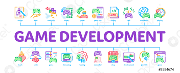

# Creación de Video Juego

    

  

    Short description
     
    <a href="https://reponame/issues/new?template=bug.md">Report bug</a>
    ·
    <a href="https://reponame/issues/new?template=feature.md&labels=feature">Request feature</a>
  

## Código Fuente

* [Lección 1](Leccion1)
  
* [Lección 2](Leccion2)
 
* [Lección 3](Leccion3)
  
* [Lección 4](Leccion4)
 
* [Lección 5](Leccion5)

## Planificación

## Autores
Andrea Trujillo Azpeitia

